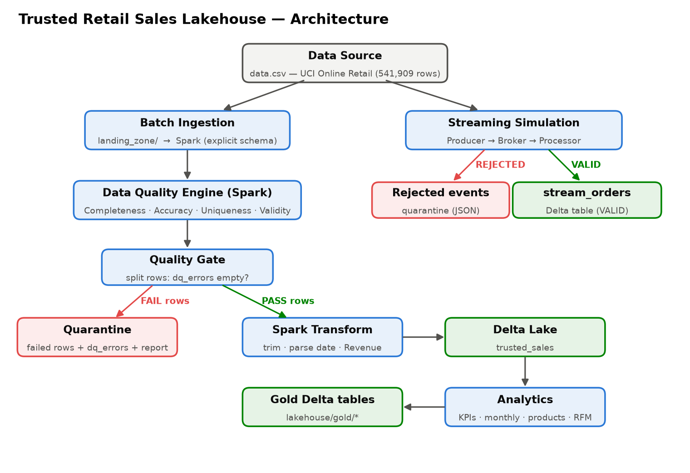

# Trusted Retail Sales Lakehouse

Final project — *Modern Data Engineering for AI Systems* (SDAIA Academy)

## Project Overview
A Spark + Delta Lake pipeline that turns a messy e-commerce export into trusted data. A quality gate decides which data is allowed through, and the analytics are built only on data that passed.

## Problem Description
An online gift shop's raw sales export contains cancellations, missing customers, zero prices, duplicate rows and non-product codes (postage, fees). Revenue and customer reports built directly on this file are wrong.

## Data Source
[UCI Online Retail](https://archive.ics.uci.edu/dataset/352/online+retail): 541,909 transaction lines from Dec 2010 to Dec 2011, covering 38 countries. The file is `data.csv` (ISO-8859-1). It is not committed; download it and place it next to the notebook.

## Workflow / Architecture

1. **Ingestion:** batch (`data.csv` → `landing_zone/` → Spark) plus a streaming simulation (Producer → Broker → Processor → Delta).
2. **Data Quality Engine** (Spark) checks every row, records the rules each row failed in `dq_errors`, and builds a JSON quality report.
3. **Quality Gate** splits the rows. Failed rows go to `quarantine_zone/` with their reasons and the report. Passed rows are transformed and written to the Delta table `lakehouse/trusted_sales`.
4. **Analytics** run on the trusted table, and the results are saved as gold Delta tables.

## Data Quality Checks
A row fails if it breaks any of these rules:

| Dimension | Rule | Failed rows |
|---|---|---|
| Completeness | `CustomerID` is null | 135,080 |
| Completeness | `Description` is null | 1,454 |
| Accuracy | `Quantity <= 0` | 10,624 |
| Accuracy | `UnitPrice <= 0` | 2,517 |
| Accuracy | sale was cancelled later | 5,563 |
| Uniqueness | duplicate of an earlier row | 5,268 |
| Validity | `InvoiceNo` doesn't match `^\d{6}$` | 9,291 |
| Validity | `StockCode` doesn't match `^\d{5}[A-Za-z]*$` | 2,995 |
| **Gate** | **PASS: 385,929 rows → Delta · FAIL: 155,980 rows → Quarantine** | |

Rows that pass are transformed: trimmed text, upper-case codes, and new `InvoiceTimestamp`, `InvoiceMonth` and `Revenue` columns.

## Analytics Output
- KPIs: revenue, orders, customers, products, average order value
- Monthly revenue
- Top 10 products
- Revenue by country
- RFM customer segments (Champions, Loyal, New/Recent, Regular, At Risk)

## Results
- 541,909 raw rows: **385,929 passed** to Delta, **155,980 failed** to quarantine (28.8%).
- Streaming: 7 events stored, 2 rejected (one cancellation, one with a missing customer and price 0).
- Trusted revenue: **£8.2M** from 18,162 orders and 4,321 customers. Average order value is £451.
- November 2011 is the peak month (£1.11M). December 2011 only covers 1–9 Dec.
- The UK accounts for 82% of revenue.
- **Champions** are 8% of customers (333) but bring **49%** of revenue. At Risk customers bring 4%.

## Technologies Used
Python · PySpark · Delta Lake (`delta-spark`) · Loguru · Matplotlib · Google Colab

## How to Run the Project
1. Open `Final_Project_Trusted_Retail_Lakehouse.ipynb` in Google Colab.
2. Run all cells. When prompted, upload `data.csv`, or place it next to the notebook first.

## Future Improvements
- Use real Kafka and Spark Structured Streaming instead of the simulation.
- Repair and replay quarantined rows, e.g. sales with a missing `CustomerID` for revenue-only reports.
- Add incremental `MERGE` loads into Delta and schedule the pipeline (e.g. Airflow).
- Connect a dashboard to the gold tables.

## SDAIA Academy GitHub Repository Link
<!-- add link here -->
[link](https://github.com/SDAIAAcademy)
